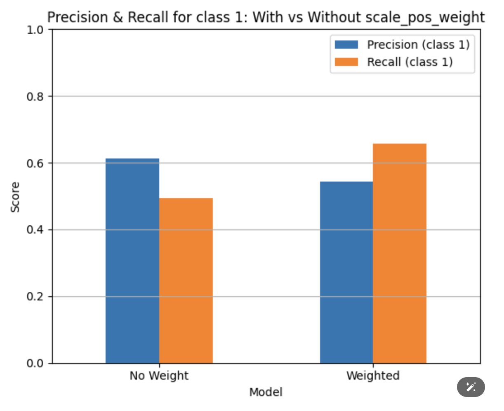
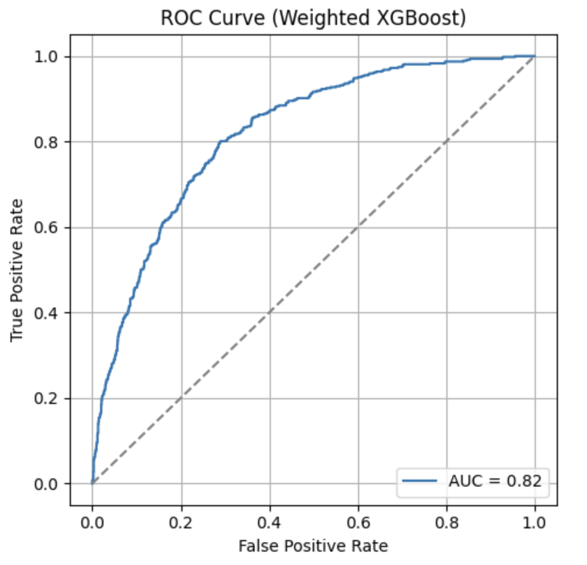
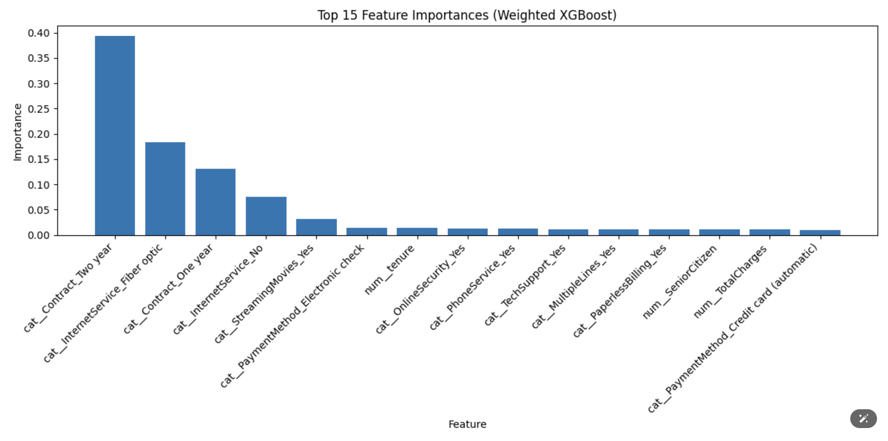

#  Customer Churn Prediction Project (XGBoost + Feature Engineering)

##  Project Overview
This project predicts customer churn based on the **Telco Customer Churn Dataset**.  
Using a full ML pipeline with `XGBoost`, we handle class imbalance, evaluate model performance (AUC 0.82), and interpret predictions through feature importance.

> 🎯 **Goal:** Help businesses identify customers likely to leave and take proactive retention actions.

---

##  Dataset

-  **Source:** [Kaggle - Telco Customer Churn](https://www.kaggle.com/datasets/blastchar/telco-customer-churn)
-  7,000+ customer records
-  **Target variable:** `Churn` (Yes/No)

---

##  Preprocessing Workflow

1. Dropped `customerID` (non-informative)
2. Split columns into numerical & categorical
3. Used `ColumnTransformer`:
   -  Standardised numerical columns
   -  One-hot encoded categorical columns (`drop="first"`)

```python
preprocessor = ColumnTransformer([
    ('num', StandardScaler(), numerical_cols),
    ('cat', OneHotEncoder(drop='first', handle_unknown='ignore'), categorical_cols)
])
```

---

##  Why Use `scale_pos_weight`?

The dataset is **imbalanced** — most customers do not churn.  
Without weighting, the model overpredicts "No Churn" and misses real churners.

We used:
```python
scale_pos_weight = 1294 / 467 ≈ 2.77
```

This significantly **boosted recall for class 1**, improving overall effectiveness.

---

##  Model Comparison

| Variant              | Precision (churn) | Recall (churn) | AUC  |
|----------------------|------------------|----------------|------|
| Without weighting    | 0.61             | 0.49           | 0.78 |
| **With weighting**   | **0.53**         | **0.67**       | **0.82** |

> ✅ Trade-off: Slight drop in precision, big gain in recall — a good trade for retention strategies.



---

## 🤖 Model & Training Code

```python
pipeline_weighted = Pipeline([
    ('preprocessor', preprocessor),
    ('model', XGBClassifier(
        use_label_encoder=False,
        eval_metric='logloss',
        scale_pos_weight=2.77,
        random_state=42
    ))
])
pipeline_weighted.fit(X_train, y_train)
```

---

## 📈 Evaluation Results

- **Accuracy**: ~78%
- **Recall (churn)**: ~0.67 
- **Confusion Matrix**: Increased true positives for churners
- **AUC Score**: `0.82` → strong overall classification performance



---

## 🔍 Feature Importance

Top influential features:
1. Contract_Two year
2. InternetService_Fiber optic
3. Contract_One year
4. InternetService_No

> 📌 Long-term contracts significantly reduce churn risk.



---

##  Conclusion

- Adjusting for class imbalance **improved churn recall by ~37%**
- Feature analysis reveals business drivers of churn
- Model is interpretable, actionable, and production-ready

---

## 🧰 Skills Demonstrated

-  Data preprocessing (`StandardScaler`, `OneHotEncoder`)
-  ML pipeline construction (`Pipeline`, `ColumnTransformer`)
-  XGBoost modeling + tuning
-  Model evaluation (precision, recall, ROC, AUC)
-  Interpretability (feature importance)
-  Data storytelling & presentation

---

>  Built to support churn reduction strategies in real-world scenarios.
